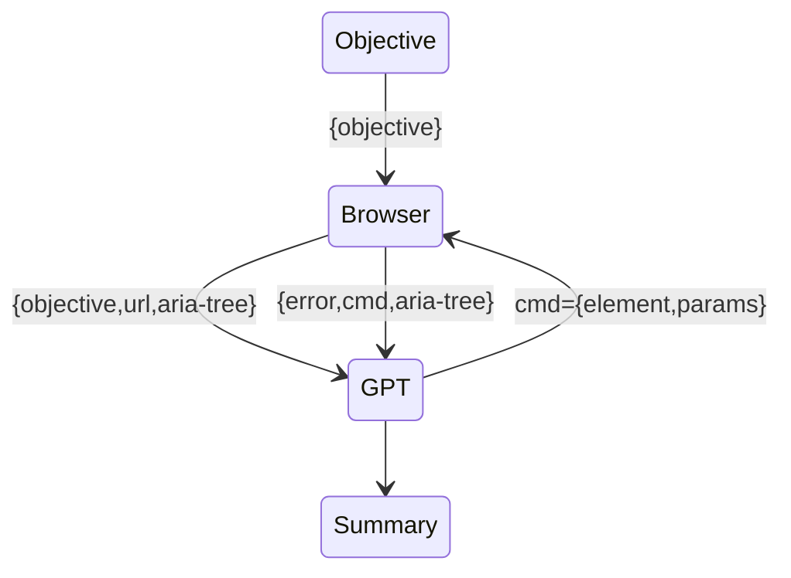

# gpt-aria

Running:

* Install node
* run `npm install`
* run `export OPENAI_API_KEY=<your key>`
* Run gpt-aria: `./gpt-aria.ts --objective "Whats the price of iphone 13 pro"`
* Note first run will take a while as puppeteer has to download chrome
* Run it starting custom start page: `./gpt-aria.ts --objective "Whats the price of iphone 14 pro" --start-url https://duckduckgo.com`

Prompt lives in `prompt.ts`, log of execution is in `log.txt`

Questions? https://discord.gg/jgWgkQvp

Sample queries:
* who was president when first starwars was released?
* `./gpt-aria.ts --objective "What is the cultural capital of western ukraine" --start-url https://bing.com --headless`

# Observations
* With certain prompting styles code-davinci-002 is identical text-davinci-003
* Multiple completions are an interesting signal of the model's certainty
* Shoveling in a lot of context can be done via code, this eliminates a lot of validation work, avoids having to specify serialization/rpc strategy.

## Using chrome accessibility tree to turn the web into a textual interface and access it like a user of a screen-reader

**Marketing Goal**: to produce a content-marketing blog post like: https://dagster.io/blog/chatgpt-langchain

**Technical goal**: 
1. Create an extension where you can enter a task and have it perform a demo like: https://www.adept.ai/act
2. Ideally we'd enable a new mode of browser interaction where a blind user can perform some task easier (eg summarization of article, or functionality to read out balance on credit card, etc)

**Scope**: Tight, initial milestone is a "weekend" project: 3-4 days.

**Prior art**:
* https://github.com/nat/natbot
* https://yihui.dev/actgpt

Technical stack:
* typescript in extension
* https://plasmo.com/ framework

### Why ARIA is superior to raw html

html:

html with ARIA accessibility tree:

## Follow-up ideas

### Have an index of gpt prompts that explain in natural language how to navigate a particular website.
* Eg for twitter it was say "In order to 'tweet', one goes to twitter.com and posts a tweet. in order to scan the latest news on twitter, one can pick use default timeline or pick a twitter list for a particular category".
* For buying a house "redfin provides search functionality and ability to narrow down location and prices"
* for shopping "amazon.com is a shopping site"
* likewise for google, wikipedia, etc
* eventually we'd want langchain-style website modules so you could specify "Summarize my inbox and news" which would be a composition of gmail and news modules

### Chrome extension that accesses page aria

https://github.com/ziolko/aria-devtools

tangent: hook up chrome extension to google sheets via oaut

https://stackoverflow.com/questions/55477723/how-to-integrate-google-sheet-to-chrome-extension

https://stackoverflow.com/questions/48335559/google-sheets-api-with-chrome-extension-how-to-use
