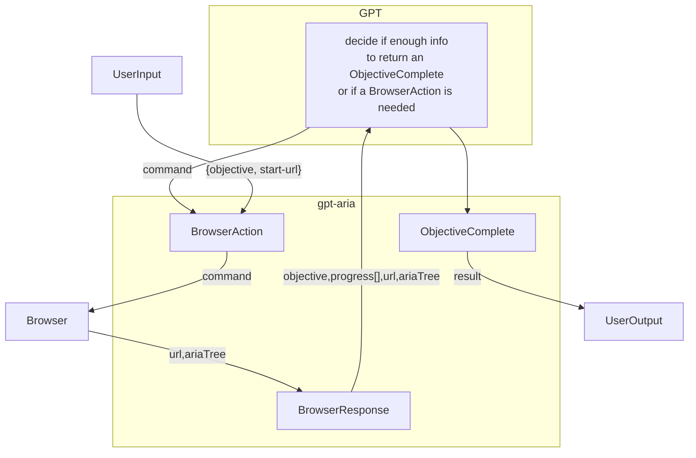

# gpt-aria

Experiment to teach gpt to make use of the chrome accessibility tree to turn the web into a textual interface and access it like a user of a screen-reader. This avoids html parsing, supports dynamic content, etc.

Running:

* Install node
* run `npm install`
* run `export OPENAI_API_KEY=<your key>`
* Run gpt-aria: `./gpt-aria.ts --objective "Whats the price of iphone 13 pro"`
* Note first run will take a while as puppeteer has to download chrome
* Run it starting custom start page: `./gpt-aria.ts --objective "Whats the price of iphone 14 pro" --start-url https://duckduckgo.com`

Prompt lives in `prompt.ts`, log of execution is in `log.txt`

Questions? https://discord.gg/jgWgkQvp

Sample queries:
* `./gpt-aria.ts --objective "What is the cultural capital of western ukraine" --start-url https://bing.com --headless`
* `./gpt-aria.ts --objective "Who was king of england when lviv was founded"  --headless`
* who was president when first starwars was released?

# Design

# Prior art:
* https://github.com/nat/natbot
* https://yihui.dev/actgpt

# Why ARIA is superior to raw html

### html:

### html with ARIA accessibility tree:

## Follow-up ideas
### Scrolling

Would be nice to have a command so gpt could scroll up/down the page to summarize content in it

### Have an index of gpt prompts that explain in natural language how to navigate a particular website.
* Eg for twitter it was say "In order to 'tweet', one goes to twitter.com and posts a tweet. in order to scan the latest news on twitter, one can pick use default timeline or pick a twitter list for a particular category".
* For buying a house "redfin provides search functionality and ability to narrow down location and prices"
* for shopping "amazon.com is a shopping site"
* likewise for google, wikipedia, etc
* eventually we'd want langchain-style website modules so you could specify "Summarize my inbox and news" which would be a composition of gmail and news modules
